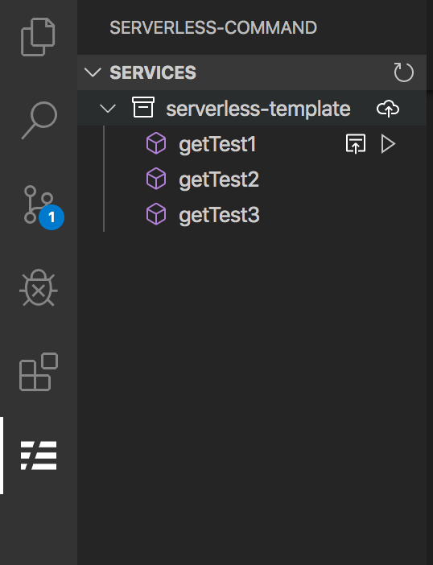
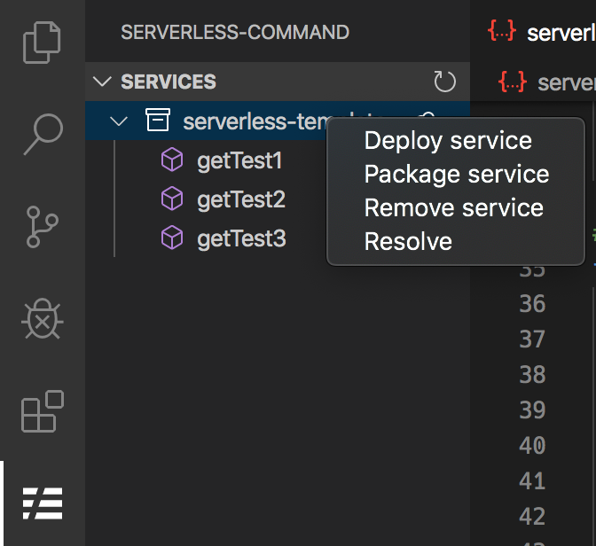
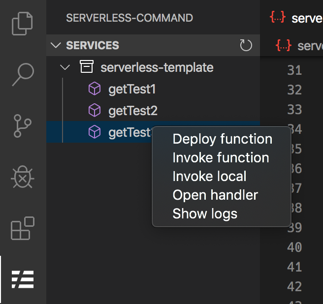

## Serverless Framework for VSCode

Serverless Framework 을 VSCode에서 손쉽게 실행할수 있으며, 명령줄이 아닌, Context Menu를 이용하여 직관적이며 편리하게 이용할수 있다.

※ 해당 extension은 기존 `serverless-vscode` extension을 기반으로 재설계 되었다.

&nbsp;

&nbsp;

## Configuration

`기본설정 > 설정 > Serverless Command` 로 들어가 설정한다.

### serverless.aws.defaultStage

기본 stage 설정 (default: "dev")

### serverless.aws.defaultRegion

기본 region 설정 (default: "ap-northeast-2")

### serverless.defaultNodeModulesPath

node_modules 경로를 설정 ('npm root -g' 명령어로 확인 가능)
default: /usr/local/lib/node_modules

### serverless.aws.credentials

AWS credentials 별칭을 별도로 설정시 사용
~/.aws/credentials 파일의 등록되어 있는 정보 (default: "default")

&nbsp;

## Context Menus

#### Package service

> `serverless package`   
> AWS에 배포가 가능한 상태로 .serverless 폴더에 해당 파일들을 packaging한다.

#### Deploy service

> `serverless deploy`   
> AWS에 어플리케이션을 배포한다.   
> 모든 설정이 배포되기 때문에 수분이 소요된다.

#### Resolve

> Resolve를 사용하면 생성 된 resolved.yml, 즉 모든 serverless 변수가 선택된 스테이지에 대한 값으로 해석 된 serverless.yml 을 볼 수 있다.

#### Deploy function

> `serverless deploy function`   
> 해당 함수와 관련된 파일을 AWS에 배포한다.   
> 배포속도가 빠르다.

#### Invoke function

> `serverless invoke function`   
> 해당 함수를 AWS Lambda 에서 실행한다.   
> `test/{함수명}.json` 파일을 참조하여 호출 (해당 파일이 없으면 오류가 발생한다.)

#### Invoke local

> `serverless invoke local function`   
> 해당 함수를 local 에서 실행한다.   
> `test/{함수명}.json` 파일을 참조하여 호출 (해당 파일이 없으면 오류가 발생한다.)

#### Show logs

> 출력 창에 배포 된 기능의 온라인 로그를 검색하고 표시한다.

#### Open handler

> 함수와 관련된 핸들러 소스 파일을 연다.

