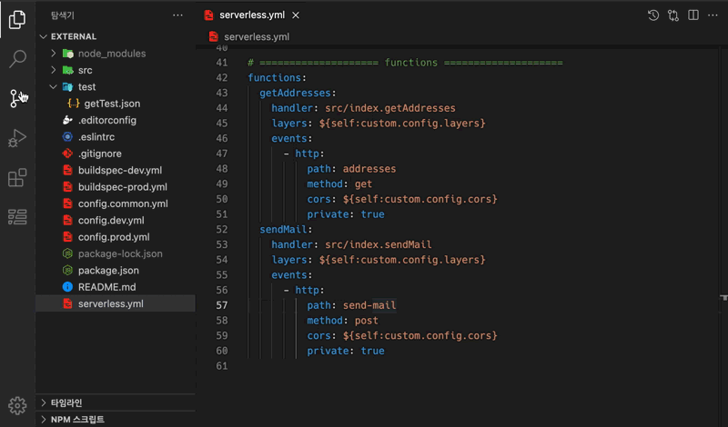
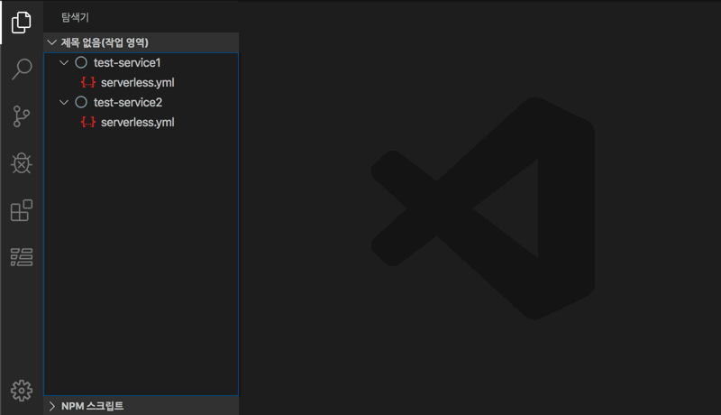

## Serverless Framework for VSCode

[](https://marketplace.visualstudio.com/items?itemName=blaxk.serverless-command)
[](https://marketplace.visualstudio.com/items?itemName=blaxk.serverless-command)
[](https://marketplace.visualstudio.com/items?itemName=blaxk.serverless-command)

Serverless Framework 을 VSCode에서 손쉽게 실행할수 있으며, TreeView를 이용하여 직관적이며 편리하게 개발할 수 있도록 도와줍니다.
AWS Project에서는 CloudWatchLogs를 바로 확인할 수 있는 기능을 지원합니다.

※ 해당 extension은 기존 `serverless-vscode` extension을 기반으로 재설계 되었습니다.

&nbsp;

### Single Project


&nbsp;

### Multiple Project


&nbsp;

## Configuration

`기본설정 > 설정 > Serverless Command` 에서 설정할 수 있습니다.  

### serverlessCommand.firstCommand

serverless 명령어 앞쪽에 추가로 설정하는 명령어 설정 (npm start &&)
> `npm start && serveless deplay`   

### serverlessCommand.aws.stage

기본 stage 설정 (default: "dev")

### serverlessCommand.aws.region

기본 region 설정 (default: "ap-northeast-2") 

### serverlessCommand.aws.credentials

AWS credentials profile 별칭을 별도로 설정시 사용   
~/.aws/credentials 파일의 등록되어 있는 별칭 (default: "")

### serverlessCommand.aws.alias

Lambda 함수에서 AWS 별칭을 사용할 수 있도록 설정 (default: "")   
> serverless-aws-alias plugin 참고

&nbsp;

## Context Menus

#### Package service

> `serverless package`   
> AWS에 배포가 가능한 상태로 .serverless 폴더에 해당 파일들을 packaging

#### Deploy service

> `serverless deploy`   
> AWS에 어플리케이션을 배포   
> 모든 설정이 배포되기 때문에 몇 분씩 소요될 수도 있습니다.

#### Resolve

> Resolve를 사용하면 생성 된 resolved.yml, 즉 모든 serverless 변수가 선택된 스테이지에 대한 값으로 해석 된 serverless.yml을 볼 수 있습니다.

#### Deploy function

> `serverless deploy function`   
> 해당 함수와 관련된 파일을 AWS에 배포   
> 파일만 배포하기때문에 배포속도가 빠릅니다.

#### Invoke function

> `serverless invoke function`   
> 해당 함수를 AWS Lambda 에서 실행  
> `./test/<functionName>.json` 파일을 참조하여 호출 (해당 파일이 없으면 오류가 발생합니다.)   
> 호출 된 함수에 전달할 입력 컨텍스트를 보유하는 json 파일   

#### Invoke local

> `serverless invoke local function`   
> 해당 함수를 local 에서 실행한다.   
> `./test/<functionName>.json` 파일을 참조하여 호출 (해당 파일이 없으면 오류가 발생합니다.)   
> 호출 된 함수에 전달할 입력 컨텍스트를 보유하는 json 파일   


#### Show logs

> 출력 창에 배포 된 기능의 온라인 로그를 검색하고 표시합니다.

#### Open handler

> 함수와 관련된 핸들러 소스 파일을 엽니다.

&nbsp;

#### Open log

> AWS CloudWatch Log를 엽니다.

#### New Open log

> AWS CloudWatch Log를 새 파일로 엽니다.

&nbsp;

## ⚠️ Caution

TreeView를 `serverless.yml` 파일을 파싱해서 구성하고 있습니다.
하지만 serverless framework의 모든 표현식의 파싱을 지원하지 못하고 있어, 아래처럼 다른 파일을 import 한다거나, 변수처리 되어 있는 부분은 파싱하지 못합니다.

``` yml
custom: 
  common: ${file(./config.common.yml)}
  config: ${file(./config.${opt:stage}.yml)}

provider:
  name: aws
  runtime: nodejs12.x
  stage: ${opt:stage}
  region: ${self:custom.common.region}

functions:
  getTest:
    name: ${sls:stage}-lambdaName
```

> `serverless.yml` 파일의 아래 항목들을 참조하여 TreeView를 구성합니다.
> - service
> - provider.name
> - functions.{key}
> - functions.{key}.name

AWS CloudWatch Logs 를 사용하기 위해서는 iam 권한이 필요합니다.
```json
{
  "Version": "2012-10-17",
  "Statement": [
    {
      "Effect": "Allow",
      "Action": [
        "logs:DescribeLogStreams",
        "logs:GetLogEvents"
      ],
      "Resource": [
        "arn:aws:logs:<region>:<accountId>:log-group::log-stream:*"
      ]
    }
  ]
}
```