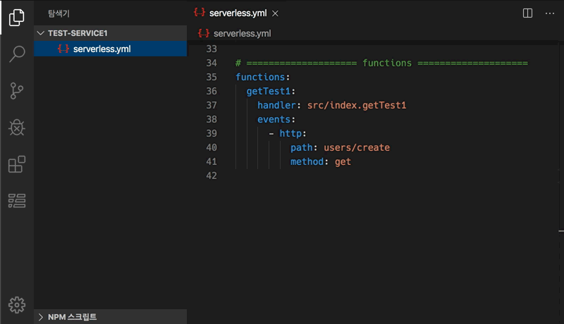

## Serverless Framework extension for VSCode

[](https://marketplace.visualstudio.com/items?itemName=blaxk.serverless-command)
[](https://marketplace.visualstudio.com/items?itemName=blaxk.serverless-command)
[](https://marketplace.visualstudio.com/items?itemName=blaxk.serverless-command)

Serverless Framework can be easily executed in VSCode, and using TreeView helps intuitive and convenient development.   
AWS Project supports the ability to immediately check CloudWatchLogs.   

&nbsp;

### Single Project


&nbsp;

### Multiple Project


&nbsp;

### AWS CloudWatch Logs


&nbsp;

## Configuration

This extension contributes the following settings: 

### serverlessCommand.firstCommand

Command setting that is additionally set before the serverless command. (npm start &&)
> `npm start && serveless deplay`   

### serverlessCommand.testFolderPath

Set the parent folder path of the <functionName>.json file referenced when executing `Invoke function` (default: "./test")

### serverlessCommand.aws.stage

Default stage for builds and deployments (default: "dev")

### serverlessCommand.aws.region

Default region for builds and deployments (default: "ap-northeast-2") 

### serverlessCommand.aws.credentials

Setting When Using AWS Credential Profile Alias   
Registered alias in ~/.aws/credentials file (default: "")

### serverlessCommand.aws.alias

Set AWS Alias Available to Lambda Functions (default: "")   
> See the description of the serverless-aws-alias plugin.

&nbsp;

## Context Menus

#### Package service

> `serverless package`   
> Package the files in the .serverless folder in a state that can be deployed to AWS

#### Deploy service

> `serverless deploy`   
> Deploy your application on AWS   
> This may take several minutes as all settings are deployed.

#### Resolve

> With Resolve you can see the generated resolved.yml i.e. serverless.yml where all serverless variables are resolved to values for the selected stage.

#### Deploy function

> `serverless deploy function`   
> Deploy the file related to that function to AWS   
> Because it distributes only files, the distribution speed is fast.

#### Invoke function

> `serverless invoke function`   
> Invoke that function in AWS Lambda  
> Invoke with reference to `./test/<functionName>.json` file (If that file does not exist, an error occurs)   
> A json file holding input data to be passed to the invoked function as the event.   

#### Invoke local

> `serverless invoke local function`   
> Invoke the function in local.   
> Invoke with reference to `./test/<functionName>.json` file (If that file does not exist, an error occurs)   
> A json file holding input data to be passed to the invoked function as the event.      


#### Show logs

> Retrieve and show the online logs of the deployed function in the output pane.

#### Open handler

> Open the handler source file that is associated with the function.

&nbsp;

#### Open log

> Open AWS CloudWatch Logs.

&nbsp;

## ⚠️ Caution

Create a TreeView by referring to the following items in the `serverless.yml` file.   
- service
- provider.name
- functions.{key}
- functions.{key}.name

Currently, not all expressions in serverless frameworks are supported.   
It may not be possible to interpret other files as below, or parts that are variable.     


``` yml
custom: 
  common: ${file(./config.common.yml)}
  config: ${file(./config.${opt:stage}.yml)}

provider:
  name: aws
  runtime: nodejs12.x
  stage: ${opt:stage}
  region: ${self:custom.common.region}

functions:
  getTest:
    name: ${sls:stage}-lambdaName
```

&nbsp;

To use AWS CloudWatch Logs, you need to set up an IAM policy.   
```json
{
  "Version": "2012-10-17",
  "Statement": [
    {
      "Effect": "Allow",
      "Action": [
        "logs:DescribeLogGroups",
        "logs:DescribeLogStreams",
        "logs:GetLogEvents"
      ],
      "Resource": [
        "arn:aws:logs:<region>:<accountId>:log-group:*:log-stream:*"
      ]
    }
  ]
}
```

&nbsp;
&nbsp;

※ This extension has been redesigned based on the existing `serverless-vscode` extension.   